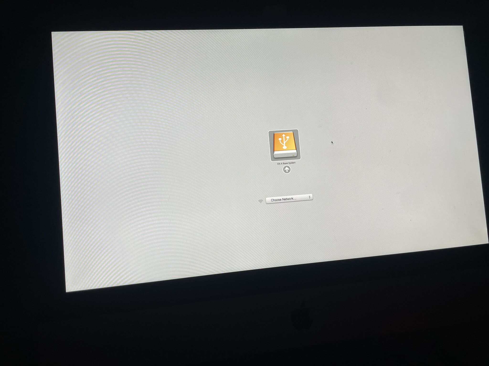
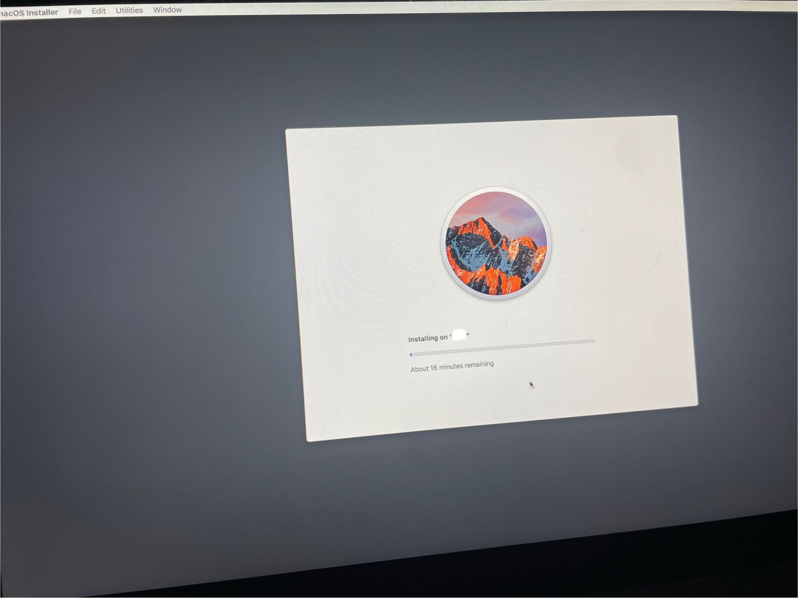
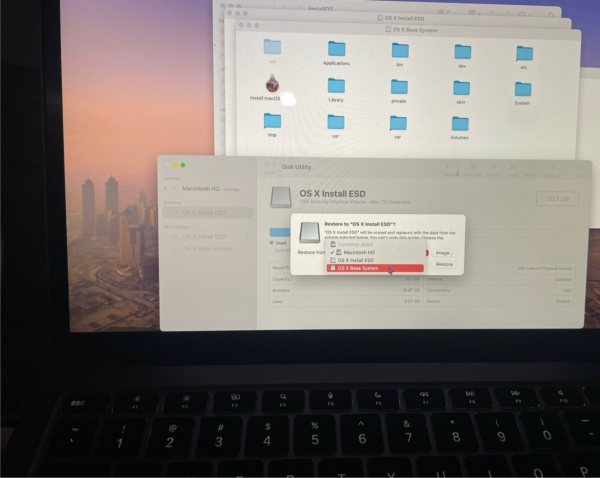
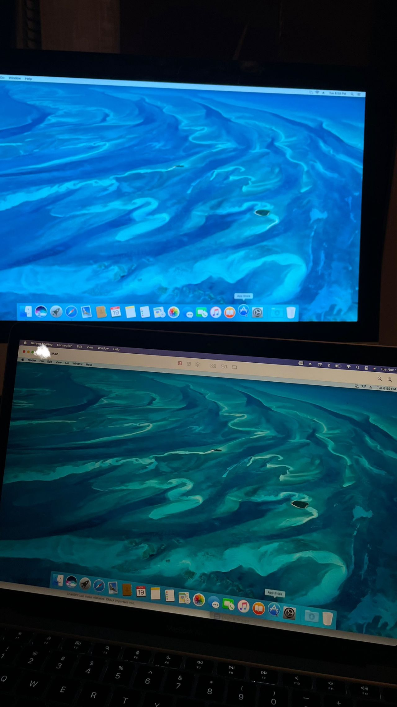
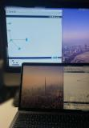

# restoring-mac-remote-workstation
Restored an older iMac through a clean macOS rebuild, USB installer recovery, system configuration. Repurposed the machine as a remote-access workstation and wireless extended display.

## **Project Overview**
The iMac originally could not boot properly and was stuck in outdated recovery utilities. I restored the machine by creating a property macOS installer, rebuilding the system fromUSB, configuring partitions, and reinstalling macOS. After the system was rebuilt, I configured it for modern usability. This included remote desktop, shared display functionality, and network-based management. This resulted in a fully revived iMac usable as:
- A standalone macOS workstation
- A remote machine accessible through screen sharing
- A wireless secondary display for productivity

## **Key Activities Completed**
- **System Recovery & OS Reinstallation**
    - Created a clean macOS installer using USB and Disk Utility
    - Rebuilt OS X Base System and restored macOS install media
    - Reformatted and re-partitioned the internal drive
    - Performed full macOS reinstall
    - Ensured proper boot sequence and installer recognition

- **Device Optimization & Configuration**
    - Reconfigured system preferences, network, and startup disk
    - Installed updates, drivers, and modern security patches
    - Cleaned up the UI, services, and login items for responsiveness

- **Remote Access & Display Repurposing**
    - Enabled macOS Screen Sharing for remote-control functionality
    - Connected iMac wirelessly as a second monitor
    - Tested latency, resolution, and responsiveness
    - Verified multi-device display workflow 

## **Screenshots**

### **1. macOS Installer Setup**

MacOS installation progressing from the recovery environment using the USB installer.

### **2. iMac Booting From USB**

Boot menu confirming successful detection of the installer drive.

### **3. Disk Utility Restore Process**

Captured the steps where the OS X Base System is restored to the USB installer.

### **4. Remote-Display Testing**

The iMac operating as a wireless secondary display using screen sharing / remote desktop tools.

### **5. iMac Fully Restored**

System Preferences open on the revived machine after a clean macOS installation.

### **6. Extended Workspace Setup**

Final setup with iMac + MacBook working together as a multi-screen environment.

## **Tools & Techniques**
- **System Recovery**
    - macOS Recovery Mode
    - USB Installer Creation
    - Disk Utility
    - OS X Base System rebuild
- **Optimization & Configuration**
    - System Preferences setup
    - Startup Disk configuration
    - Security & privacy adjustments
    - Account setup and OS activation
- **Remote Management**
    - macOS Screen Sharing
    - LAN-based remote desktop
    - Wireless extended display
    - Network configuration

## **Purpose**
This project demonstrates how older Apple hardware can be successfully rehabilitated and repurposed. By restoring the OS, correcting boot errors, and enabling remote display features, the iMac becomes a functional workstation again. This is ideal for software labs, display extensions, or educational environments. It showcases practical skills in macOS recovery, disk imaging, hardware repurposing, and remote system management.

